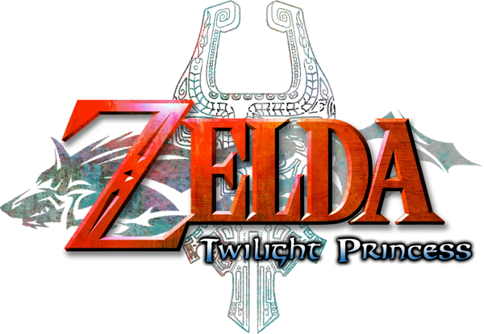

# TP-Patch

Classic Controller and GameCube controller support for **The Legend of Zelda: Twilight Princess** on Wii.
The game only accepts a Wii Remote with a Nunchuk. These patches make a Classic Controller, or a
GameCube controller in port 1, play it, with no pointer or motion controls needed.

| Release | Disc id | Status |
|---|---|---|
| USA | `RZDE01` v0 | supported |
| USA Rev 2 | `RZDE01` v2 | supported (most tested) |
| Europe / Australia | `RZDP01` | supported |
| Japan | `RZDJ01` | supported |
| Korea | `RZDK01` | not yet (different SDK build) |

## Controls

| Action | Classic Controller | GameCube controller |
|---|---|---|
| Move | left stick | control stick |
| Aim / pointer | right stick | C-stick |
| A / B | A / B | A / B |
| Target | L | L |
| Camera (C) | ZL | L + R |
| Sword swing (hold: spin attack) | ZR | Z |
| Shield bash | R | R |
| Items 1 / 2 | X / Y | X / Y |
| D-pad | D-pad | D-pad |
| Plus / Minus / Home | + / - / Home | Start / Z + Start / L + R + Start |

## Install

* **Patcher (recommended)**: drop your `.wbfs` or `.iso` on the app (`tools/gui.py`, or the builds
  attached to a release). It extracts the disc, patches `sys/main.dol`, rebuilds the image in place and keeps
  the original as `<name>.bak`. Command line: `python3 tools/patch_disc.py "game.wbfs"`.
* **Riivolution**: copy `riivolution/<ID>.<ver>.xml` (for example `RZDE01.2.xml`) into your Riivolution `riivolution` folder.
* **Gecko codes**: `codes/<ID>.<ver>.ini` (Dolphin) or `.txt` (loaders). Not for use together with a loader's
  own code handler on real hardware, since the routines live in low memory.

The patcher and the Riivolution/Gecko output are generated from the same data, so they cannot disagree.

## How it works

See [docs/TECHNICAL.md](docs/TECHNICAL.md).

## Credits

* **Vague Rant**: the original Classic Controller approach this builds on.
* **quatric**: the hook designs, GameCube support, gesture mapping and the patcher.
* Patcher design after [Excite-Patch](https://github.com/quatric/Excite-Patch); porting notes from the
  [GC porting guide](https://gist.github.com/quatric/257a40993345c2c7568b9154c00186fd).

No game data is included. You need your own legally obtained disc image.
